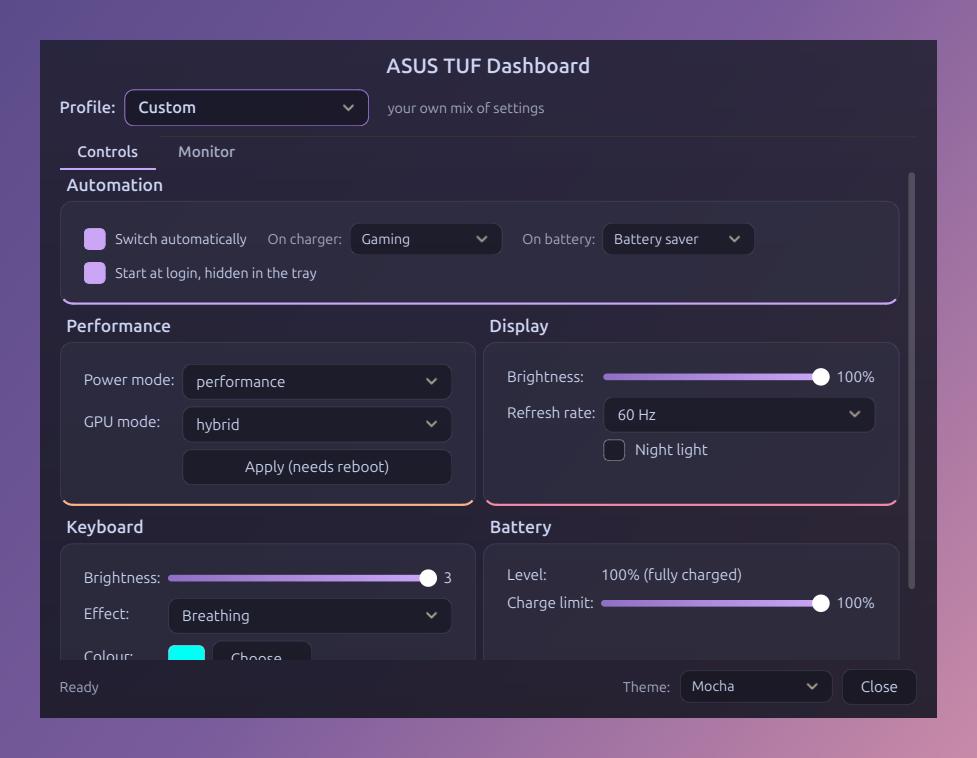
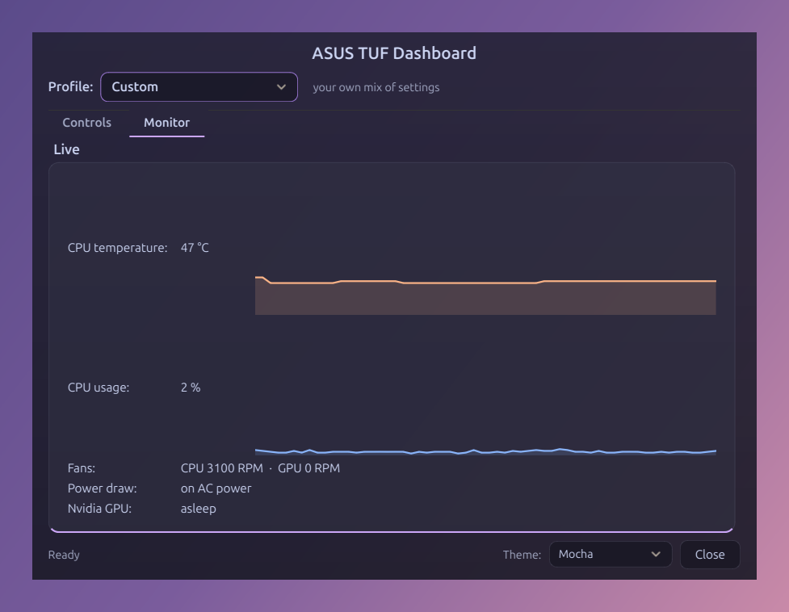

# ASUS Dashboard

[](https://github.com/xAlayham/ASUS-Dashboard/actions/workflows/tests.yml)

A control panel for ASUS laptops on Linux. ASUS's own tool, Armoury Crate, only runs on Windows. This does the same job on Ubuntu: power mode, GPU mode, display, keyboard lighting, battery charge limit and live sensors, in one window.





## Features

- **Profiles.** One choice sets the power mode, refresh rate and keyboard light together: Gaming, Balanced, Silent or Battery saver.
- **Automatic switching.** Pick a profile for when the charger is plugged in and another for battery. The dashboard switches when the power source changes.
- **Power mode.** Power saver, balanced or performance.
- **GPU mode.** Hybrid, integrated or Nvidia. This one needs your password and a reboot.
- **Display.** Brightness, refresh rate and night light.
- **Keyboard.** Brightness, and a lighting effect (static, breathing, colour cycle or strobing) with a colour and speed.
- **Battery.** A charge limit between 20% and 100%, which is restored at every login.
- **Live monitor.** CPU temperature and usage as graphs, fan speeds, power draw and whether the Nvidia card is awake.
- **Tray icon.** Closing the window keeps the dashboard running in the top bar, where you can switch profile or quit.
- **Themes.** Four colour themes.

Any feature your laptop does not have is greyed out. Nothing crashes because a file is missing.

## Requirements

- An ASUS laptop that the Linux kernel's `asus-wmi` driver supports
- Ubuntu 24.04 with the GNOME desktop
- For power modes: `power-profiles-daemon` (installed by default on Ubuntu)
- For GPU modes: Ubuntu's Nvidia driver, which provides `prime-select`

## Install

```bash
git clone https://github.com/xAlayham/ASUS-Dashboard.git
cd ASUS-Dashboard
./install.sh
```

The installer asks for your password once. It needs it to create a group called `asus-dashboard`, add you to it, and install rules that let that group change the keyboard light and charge limit. Everything else is installed for your user only.

To see what it would do without changing anything:

```bash
./install.sh --dry-run
```

After the first install, **reboot** so your new group membership takes effect. The installer is safe to run again, for example after pulling an update. Steps that are already done are skipped.

## Using it

Start **ASUS Dashboard** from the app menu. It also starts by itself at login, hidden in the tray. You can turn that off in the Automation section.

From a terminal:

| Command | Does |
|---|---|
| `.venv/bin/asus-dashboard` | Opens the window |
| `.venv/bin/asus-dashboard --hidden` | Starts with only the tray icon |
| `.venv/bin/asus-dashboard-apply` | Re-applies your saved settings. A login service runs this for you. |

Your settings are saved in `~/.config/asus-dashboard/settings.json`.

## Uninstall

```bash
./uninstall.sh
```

This removes the service, the menu entries, the rules, the group and the Python environment. It asks before deleting your saved settings.

## Supported hardware

It was built and tested on one laptop: an **ASUS TUF Gaming F15 (FX506HF)** running Ubuntu 24.04 with GNOME on X11.

The battery, the Nvidia card and the laptop screen are found automatically, so other ASUS models should work, but they have not been tested. If you try it on another model, please open an issue and say what worked.

## How it works

Each feature uses the standard Linux way of doing that job:

| Feature | How |
|---|---|
| Keyboard light, lighting effect, charge limit | Files under `/sys`, made writable for the `asus-dashboard` group by udev rules |
| Power mode | `power-profiles-daemon`, over D-Bus |
| Refresh rate | GNOME's display service (Mutter), over D-Bus |
| Screen brightness | GNOME's settings service, over D-Bus |
| Night light | `gsettings` |
| GPU mode | `prime-select`, run through `pkexec` |
| Battery level and charger events | UPower, over D-Bus |
| Temperatures, fans, CPU usage | Files under `/sys` and `/proc` |

Some settings are forgotten by the hardware when the laptop restarts, such as the charge limit and the keyboard lighting. A small systemd user service re-applies them at login.

## Development

```bash
python3 -m venv --system-site-packages .venv
source .venv/bin/activate
pip install -e .
python3 -m pytest
```

The venv needs `--system-site-packages` because the D-Bus module comes from Ubuntu's packages, not from pip.

The tests need no ASUS hardware. Every hardware file, command and D-Bus call is replaced by a stand-in, and a test that tries to reach the real system fails. They run on every push.

## Known limitations

- Changing the GPU mode needs a reboot.
- The refresh rate cannot be changed while an external monitor is connected.
- Only the GNOME desktop is supported.
- Wayland sessions have not been tested.
- Starting the dashboard a second time does not always bring the existing window to the front. Use the tray icon's **Show dashboard** instead.

## Licence

MIT. See [LICENSE](LICENSE).


This is an independent project. It is not affiliated with or endorsed by ASUS.